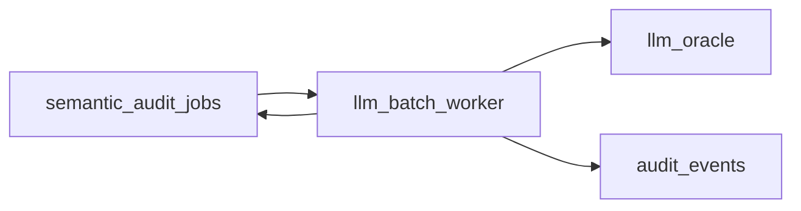

# LLM Oracle 接入 RFC v0.1

> **目的**：在引入付费 LLM 之前，冻结工程与数据边界，避免 Phase E 临时拍脑袋接 API。  
> **非目标**：本文不选定供应商、不承诺上线时间表。

**交叉引用**：[威胁模型范围 v1.0](../security/threat-model-scope-v1.0.md) · [审计事件模式 v1.0](../spec/audit-event-schema-v1.0.md) · [Phase D 复核手册](../operations/phase-d-human-review-runbook-v1.0.md) · [few-shot 样本目录](../operations/llm-calibration/)

---

## 1. 架构位置

- **输入**：`semantic_audit_jobs` 中路由到 `llm_queue` 的条目（Phase E 扩展 `internal/queue.Route`）。  
- **处理**：批处理 Worker 拉取任务 → 构造 prompt → 调用 Oracle → 解析结构化输出（verdict / confidence / rationale）。  
- **输出**：与 Phase D 一致——**写回队列状态**并**追加** `audit_event`（append-only；遵守 C-6）。  
- **失败降级**：LLM 超时、配额耗尽或解析失败时，任务回到 `human_review` 或保持可人工处理路径（与 Phase D 兼容）。

---

## 2. 数据最小化与隐私

- **默认**：仅向 prompt 注入**规则允许的字段**（如 `text_ref` 摘要、任务描述脱敏版、rule_id、subject 类型）；原始 PII、精确坐标、完整证据 URL 默认不入模。  
- **可审计**：prompt 摘要或 hash 写入审计事件 `evidence`（与现有 S 类 schema 对齐方向）。  
- **留存**：与威胁模型中的数据流边界一致；跨境传输若存在须在部署层显式评估（见实施计划「运行环境与数据流边界」）。

---

## 3. Few-shot 与阈值

- **来源**：维护于 [`docs/operations/llm-calibration/`](../operations/llm-calibration/)，按 `rule_id` 分文件；与规则 YAML 中 `few_shot_examples` 保持可追溯对应关系。  
- **阈值**：沿用规则 YAML 的 `confidence_threshold`（flag / block）；Oracle 输出不得低于文档约定精度（例如 block 路径需 ≥ block 阈值）。  
- **校准流程**：新规则上线前，必须完成「人工标注样本 → 离线回放 → 调整 prompt/阈值」的最小闭环（细节见校准目录 README）。

---

## 4. 成本与开关

- **硬开关**：环境变量级 `LLM_ORACLE_ENABLED=false` 时，Worker 不发起外呼，仅保留人工队列。  
- **批大小 / QPS**：由配置上限约束，防止队列突刺打爆预算。  
- **观测**：每次调用记录 latency、token 估算（若可得）、错误类，对接现有结构化日志。

---

## 5. 验收（Phase E 启动前）

- [ ] 本 RFC 与威胁模型、审计 schema 无冲突条款  
- [ ] 至少 3 条优先 S 类规则具备校准样本目录  
- [ ] 失败降级路径在集成测试中覆盖（可为 mock Oracle）
